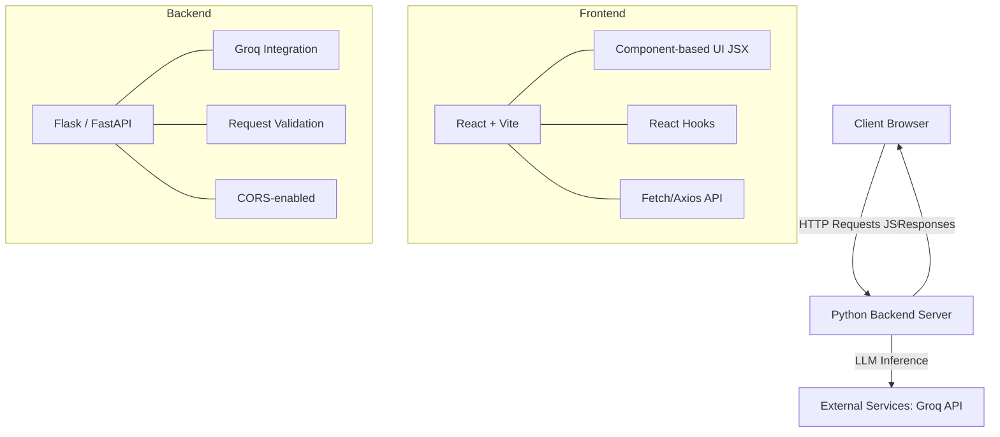

<div align="center">
  <h1>🌟 Souli — Frontend & Backend</h1>
  <p>A full-stack AI-powered application built with React + Vite and Python (Flask/FastAPI), leveraging the Groq API for ultra-fast LLM inference.</p>

  
  
  
  
  
</div>

<br />

## 📖 Table of Contents
- [Overview](#-overview)
- [Architecture](#-architecture)
- [Project Structure](#-project-structure)
- [Frontend](#-frontend)
- [Backend](#-backend)
- [Environment Configuration](#-environment-configuration)
- [Getting Started](#-getting-started)
- [Deployment](#-deployment)
- [Contributing](#-contributing)
- [License](#-license)

---

## 🎯 Overview
**Souli** is designed as a modern, scalable full-stack application that bridges a responsive React frontend with a Python-powered backend. The architecture follows a clean separation of concerns:
- **Frontend**: Handles UI/UX and state management.
- **Backend**: Manages business logic, AI model orchestration via Groq, and data processing.

### ✨ Key Features
- **AI-Powered Conversations** — Integrates Groq’s ultra-fast LLM inference API.
- **Modern React UI** — Built with Vite for lightning-fast development and production builds.
- **RESTful API** — Clean, predictable API endpoints for frontend-backend communication.
- **Environment-Driven Configuration** — Secure secret management via `.env` files.
- **Scalable Structure** — Monorepo layout supporting independent frontend and backend development.

---

## 🏗 Architecture



### 🔄 Communication Flow
`User Input` ➡️ `React Component` ➡️ `State Update` ➡️ `API Call (POST /api/chat)` ➡️ `Backend` ➡️ `Groq API (LLM)`

---

## 📂 Project Structure

```text
Souli-Frontend-and-Backend/
├── frontend/                    # React + Vite Application
│   ├── src/
│   │   ├── components/          # Reusable UI components
│   │   ├── pages/               # Route-level page components
│   │   ├── hooks/               # Custom React hooks
│   │   ├── services/            # API service functions
│   │   ├── context/             # React Context providers
│   │   ├── assets/              # Static assets (images, fonts)
│   │   ├── App.jsx              # Root component & routing
│   │   ├── main.jsx             # Entry point (ReactDOM.render)
│   │   └── index.css            # Global styles
│   ├── public/                  # Public static files
│   ├── index.html               # HTML template
│   ├── vite.config.js           # Vite configuration
│   ├── package.json             # Frontend dependencies
│   └── .eslintrc.cjs            # ESLint configuration
│
├── backend/                     # Python API Server
│   ├── app/
│   │   ├── routes/              # API route definitions
│   │   ├── services/            # Business logic & Groq integration
│   │   ├── models/              # Data models & schemas
│   │   ├── utils/               # Utility functions
│   │   └── __init__.py          # App factory
│   ├── tests/                   # Unit & integration tests
│   ├── app.py                   # Application entry point
│   ├── requirements.txt         # Python dependencies
│   └── .env                     # Environment variables (NOT in Git)
│
├── .gitignore                   # Git ignore rules
└── README.md                    # This file
```

---

## 💻 Frontend

### Tech Stack
| Technology | Purpose | Version |
|---|---|---|
| **React** | UI library for building component-based interfaces | `^18.x` |
| **Vite** | Next-generation frontend build tool | `^5.x` |
| **JavaScript (ES6+)** | Primary language with modern syntax | `ES2022` |
| **CSS3** | Styling with modern features (Flexbox, Grid) | — |
| **ESLint** | Static code analysis for code quality | `^8.x` |

### Why Vite?
- **Instant Server Start** — Starts in milliseconds (native ESM).
- **Lightning-Fast HMR** — Hot Module Replacement updates instantly.
- **Optimized Builds** — Uses Rollup for highly optimized production bundles.

### Running the Frontend
#### Development
```bash
cd frontend
npm install        # Install dependencies
npm run dev        # Start dev server (http://localhost:5173)
```

#### Production Build
```bash
npm run build      # Creates optimized `dist/` folder
```

---

## ⚙️ Backend

### Tech Stack
| Technology | Purpose | Version |
|---|---|---|
| **Python** | Primary backend language | `3.10+` |
| **Flask / FastAPI** | Web framework for API endpoints | Latest |
| **Groq SDK** | Integration with Groq’s LLM inference API | Latest |
| **python-dotenv** | Environment variable management | Latest |
| **Flask-CORS** | Cross-Origin Resource Sharing support | Latest |

### Running the Backend
#### Development
```bash
cd backend
python -m venv venv              # Create virtual environment

# Activate virtual environment
source venv/bin/activate         # macOS/Linux
# venv\Scripts\activate          # Windows

pip install -r requirements.txt  # Install dependencies
python app.py                    # Start server (http://localhost:5000)
```

#### Production Build
```bash
# Flask
pip install gunicorn
gunicorn -w 4 -b 0.0.0.0:5000 app:app

# FastAPI
pip install uvicorn
uvicorn app:app --host 0.0.0.0 --port 5000 --workers 4
```

### API Design
**Chat Endpoint (POST `/api/chat`)**
```json
// Request Body
{
  "message": "Explain quantum computing in simple terms",
  "model": "llama3-8b-8192" 
}

// Response Body
{
  "response": "Quantum computing is a type of computing that uses...",
  "model": "llama3-8b-8192",
  "tokens_used": 150,
  "timestamp": "2024-01-15T10:30:00Z"
}
```

---

## 🔐 Environment Configuration

Create a `.env` file in the `backend/` directory:

```env
# backend/.env
GROQ_API_KEY=your_actual_groq_api_key_here
FLASK_ENV=development
FLASK_PORT=5000
CORS_ORIGIN=http://localhost:5173
```
> ⚠️ **IMPORTANT**: Never commit `.env` files to Git! Ensure it is added to your `.gitignore`.

---

## 🚀 Getting Started

### Prerequisites
- **Node.js** 18+ (for frontend)
- **Python** 3.10+ (for backend)
- **Git**
- **Groq API Key** ([Get one here](https://console.groq.com/keys))

### Installation
```bash
# 1. Clone the repository
git clone https://github.com/abdulahmalik3692-hub/Souli-Frontend-and-Backend.git
cd Souli-Frontend-and-Backend

# 2. Setup Frontend
cd frontend
npm install

# 3. Setup Backend
cd ../backend
python -m venv venv
source venv/bin/activate
pip install -r requirements.txt

# 4. Configure Environment (Edit .env with your Groq API key)
cp .env.example .env
```

---

## 🌍 Deployment

### Frontend (Vercel / Netlify)
1. Build the production bundle: `npm run build` inside `frontend/`
2. Deploy the `dist/` folder to Vercel, Netlify, or similar hosting.
3. Set environment variable: `VITE_API_URL=https://your-backend-url.com`

### Backend (Render / Railway / Heroku)
1. Push code to GitHub.
2. Connect your repository to your chosen platform.
3. Add environment variables in the platform dashboard.
4. Set start command: `gunicorn app:app` (Flask) or `uvicorn app:app` (FastAPI).

---

## 🤝 Contributing
1. Fork the repository
2. Create a feature branch: `git checkout -b feature/your-feature`
3. Commit your changes: `git commit -m "Add your feature"`
4. Push to the branch: `git push origin feature/your-feature`
5. Open a Pull Request

---

## 📜 License
This project is licensed under the MIT License.

### 🙌 Acknowledgments
- **Groq** — For providing ultra-fast LLM inference
- **React Team** — For the powerful UI library
- **Vite** — For revolutionizing frontend tooling
- **Flask/FastAPI Community** — For excellent Python web frameworks

---
<div align="center">
  <b>Built with ❤️ by Abdulah Malik</b>
</div>