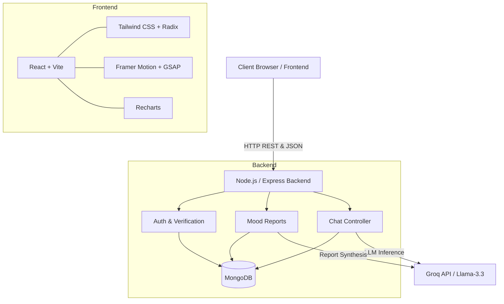
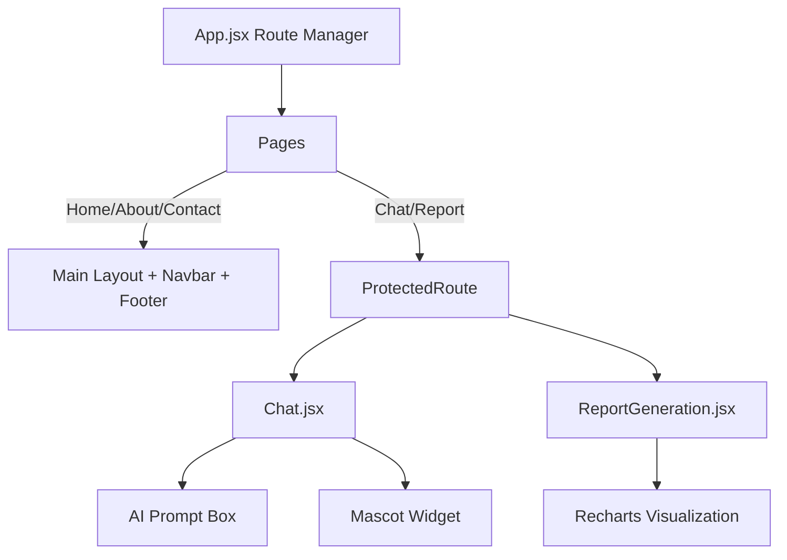

<div align="center">
  <h1>🌟 Souli (Soulify) — AI-Powered Mood & Mindfulness App</h1>
  <p>A full-stack AI-powered application built with React + Vite, Tailwind CSS, Framer Motion, and Node.js (Express), leveraging the Groq API for fast LLM inference and MongoDB for data persistence.</p>

  
  
  
  
  
  
</div>

<br />

## 📖 Table of Contents
- [Overview](#-overview)
- [Architecture](#-architecture)
- [Project Structure](#-project-structure)
- [Frontend](#-frontend)
- [Backend](#-backend)
- [Environment Configuration](#-environment-configuration)
- [Getting Started](#-getting-started)
- [Deployment](#-deployment)

---

## 🎯 Overview
**Souli (Soulify)** is designed as a modern, scalable full-stack application that bridges a responsive, heavily animated React frontend with a Node.js-powered backend. 

### ✨ Key Features
- **AI-Powered Conversations** — Integrates Groq’s ultra-fast LLM inference API.
- **Dynamic Animations** — Powered by Framer Motion and GSAP for a premium feel.
- **Mood Tracking & Insights** — Visualize emotional trends over time with Recharts.
- **Modern React UI** — Built with Vite, Tailwind CSS, and Radix UI primitives.
- **Authentication** — Secure email-based verification system.

---

## 🏗 Architecture

### System Architecture


### Frontend Architecture


### 🔄 Communication Flow
`User Input` ➡️ `React Component` ➡️ `API Call (POST /api/chat)` ➡️ `Express Backend` ➡️ `Groq API (LLM)` ➡️ `Save to MongoDB` ➡️ `Update UI`

---

## 📂 Project Structure

```text
Souli-Frontend-and-Backend/
├── src/                         # Frontend React Source
│   ├── assets/                  # Static assets (images, videos)
│   ├── components/              # Reusable UI components (Mascot, UI elements)
│   ├── pages/                   # Route-level components (Home, Chat, Report, etc.)
│   ├── theme/                   # Theme configuration and utilities
│   ├── styles/                  # Custom CSS stylesheets
│   ├── utils/                   # Frontend utilities and auth helpers
│   ├── App.jsx                  # Root component & routing
│   └── main.jsx                 # Entry point
├── backend/                     # Node.js Express Backend
│   ├── db.js                    # MongoDB connection and schema operations
│   ├── server.js                # Express app, routes, and Groq integration
│   ├── constants.js             # Shared backend constants
│   ├── package.json             # Backend dependencies
│   └── .env                     # Backend environment variables
├── public/                      # Public static files
├── index.html                   # HTML template
├── tailwind.config.js           # Tailwind CSS configuration
├── vite.config.js               # Vite configuration
└── package.json                 # Frontend dependencies
```

---

## 💻 Frontend

### Tech Stack
| Technology | Purpose |
|---|---|
| **React (v19)** | UI library for building component-based interfaces |
| **Vite** | Next-generation frontend build tool |
| **Tailwind CSS** | Utility-first CSS framework for rapid styling |
| **Framer Motion / GSAP** | High-performance animations and transitions |
| **Recharts** | Composable charting library for mood tracking |
| **React Router** | Client-side routing |
| **Three.js** | 3D graphics and interactions |

### Running the Frontend
```bash
# In the root directory
npm install        # Install frontend dependencies
npm run dev        # Start dev server (http://localhost:5173)
```

---

## ⚙️ Backend

### Tech Stack
| Technology | Purpose |
|---|---|
| **Node.js + Express** | Web framework for REST API |
| **MongoDB** | NoSQL database for users, sessions, and mood logs |
| **Groq SDK** | Integration with Groq’s LLM inference API |
| **dotenv** | Environment variable management |
| **CORS** | Cross-Origin Resource Sharing support |

### Running the Backend
```bash
cd backend
npm install        # Install backend dependencies
npm run dev        # Start server with Nodemon (http://localhost:5000)
```

---

## 🔐 Environment Configuration

Create a `.env` file in the `backend/` directory:

```env
# backend/.env
GROQ_API_KEY=your_actual_groq_api_key_here
PORT=5000
MONGODB_URI=your_mongodb_atlas_connection_string
```
> ⚠️ **IMPORTANT**: Never commit `.env` files to Git! Ensure it is added to your `.gitignore`.

---

## 🚀 Getting Started

### Prerequisites
- **Node.js** 18+
- **MongoDB Atlas** Account & Connection String
- **Groq API Key** ([Get one here](https://console.groq.com/keys))

### Installation
```bash
# 1. Clone the repository
git clone https://github.com/abdulahmalik3692-hub/Souli-Frontend-and-Backend.git
cd Souli-Frontend-and-Backend

# 2. Setup Frontend
npm install

# 3. Setup Backend
cd backend
npm install

# 4. Configure Environment
# Create backend/.env with GROQ_API_KEY and MONGODB_URI

# 5. Start Application
# Terminal 1: Frontend
npm run dev
# Terminal 2: Backend
cd backend && npm run dev
```

---

## 🌍 Deployment

### Frontend (Vercel / Netlify)
1. Build the production bundle: `npm run build`
2. Deploy the `dist/` folder.
3. Update API endpoints to point to your deployed backend URL.

### Backend (Render / Railway / Heroku)
1. Set the root directory to `backend/` (or deploy only the backend folder).
2. Add environment variables (`GROQ_API_KEY`, `MONGODB_URI`, `PORT`) in the dashboard.
3. Set start command: `npm start`.